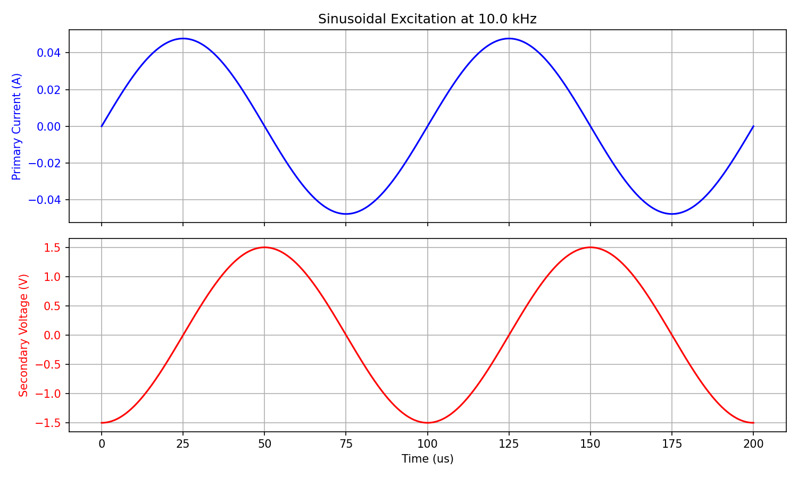
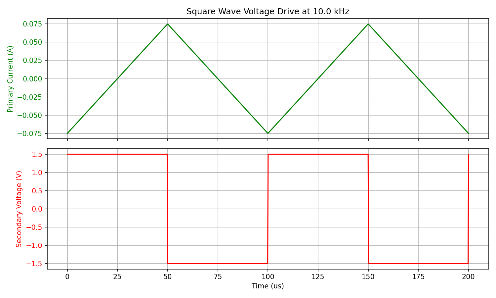

# Axle Counter Coil Parameter Analysis

This report calculates the primary transmitter coil parameters required to induce a $3\text{ V}_{p-p}$ voltage on the secondary receiver coil of an axle counter system. Calculations are performed for sinusoidal and square wave excitation in the $10\text{ kHz}$ to $20\text{ kHz}$ range under the assumption of $99.99\%$ magnetic flux loss.

---

## 1. Coil Geometry & Assumed Parameters

The secondary receiver coil parameters are defined by the specification. For the primary transmitter coil, we assume a practical air-core geometry of $100$ turns with a $100\text{ cm}^2$ area. 

| Parameter | Primary Transmitter Coil ($p$) | Secondary Receiver Coil ($s$) |
| :--- | :--- | :--- |
| **Number of Turns ($N$)** | $100$ (Assumed) | $60$ (Given) |
| **Coil Area ($A$)** | $100\text{ cm}^2 = 0.01\text{ m}^2$ (Assumed) | $600\text{ cm}^2 = 0.06\text{ m}^2$ (Given) |
| **Equivalent Radius ($r$)** | $5.64\text{ cm} = 0.0564\text{ m}$ | $13.82\text{ cm} = 0.1382\text{ m}$ |
| **Wire Radius ($a$)** | $0.5\text{ mm}$ (Copper, $1\text{ mm}$ diam.) | $0.5\text{ mm}$ (Copper, $1\text{ mm}$ diam.) |

---

## 2. Inductance & Coupling Calculations

Using basic electromagnetic physics, the self-inductance ($L$) of a multi-turn thin circular loop coil is:
$$L \approx \mu_0 N^2 r \left( \ln\left(\frac{8r}{a}\right) - 2 \right)$$

where $\mu_0 = 4\pi \times 10^{-7}\text{ H/m}$.

For the coupling under $99.99\%$ flux loss ($\text{efficiency } \eta = 10^{-4}$), we analyze **Interpretation A**: The flux linking the secondary is $\Phi_s = 10^{-4} \Phi_p$ (where $\Phi_p$ is the flux generated per turn by the primary). This yields a mutual inductance of:
$$M = 10^{-4} \frac{N_s}{N_p} L_p$$

### Calculated Values
* **Primary Inductance ($L_p$):** $3.41\text{ mH}$
* **Secondary Inductance ($L_s$):** $3.56\text{ mH}$
* **Mutual Inductance ($M$):** $0.2044\text{ }\mu\text{H}$
* **Coupling Coefficient ($k$):** $5.87 \times 10^{-5}$

---

## 3. Sine Wave Excitation (10 kHz - 20 kHz)

Under sinusoidal excitation, the target secondary peak-to-peak voltage $V_{s, p-p} = 3\text{ V}$ ($V_{s, peak} = 1.5\text{ V}$) requires a primary peak current of:
$$I_{p, peak} = \frac{V_{s, peak}}{\omega M} = \frac{1.5}{2\pi f M}$$

Without matching, driving this current requires massive voltages due to inductive reactance ($X_p = \omega L_p \gg R_p$). By placing a tuning capacitor $C_p$ in series with the primary:
$$C_p = \frac{1}{\omega^2 L_p}$$
the reactive impedance is cancelled, and the required driving voltage drops to $V_{p} = I_p R_{p, AC}$.

### Sinusoidal Parameters (Interpretation A)

| Parameter | $10\text{ kHz}$ | $20\text{ kHz}$ |
| :--- | :--- | :--- |
| **Skin Depth ($\delta$)** | $0.652\text{ mm}$ | $0.461\text{ mm}$ |
| **AC Resistance ($R_{p, AC}$)** | $0.764\text{ }\Omega$ | $1.045\text{ }\Omega$ |
| **Required Peak Current ($I_{p, peak}$)** | $116.79\text{ A}$ | $58.39\text{ A}$ |
| **Required RMS Current ($I_{p, rms}$)** | $82.58\text{ A}$ | $41.29\text{ A}$ |
| **Uncompensated Driving Voltage** | $50.00\text{ kV}_{p-p}$ | $50.00\text{ kV}_{p-p}$ |
| **Resonant Series Capacitor ($C_p$)** | $74.35\text{ nF}$ | $18.59\text{ nF}$ |
| **Resonant Driving Voltage** | $178.39\text{ V}_{p-p}$ | $122.07\text{ V}_{p-p}$ |

> [!TIP]
> Resonant tuning reduces the driving voltage by a factor of over **280×** to **400×**, bringing it into the range of standard high-power electronic drivers.

---

## 4. Square Wave Excitation (10 kHz - 20 kHz)

### Case 1: Square Wave Voltage (Inductance Dominated)
If the primary is driven by a square-wave voltage of amplitude $\pm V_{p, peak}$, the secondary voltage is also a square wave with:
$$V_{s, p-p} = \frac{M}{L_p} V_{p, p-p} \implies V_{p, p-p} = \frac{L_p}{M} V_{s, p-p} = 50.00\text{ kV}_{p-p}$$
This voltage remains constant over frequency. The primary current is a triangular wave with:
* **$10\text{ kHz}$ Peak Current:** $183.45\text{ A}$
* **$20\text{ kHz}$ Peak Current:** $91.72\text{ A}$

### Case 2: Square Wave Current with $1\text{ }\mu\text{s}$ Rise Time ($t_r$)
If a square-wave current is driven through the primary, the secondary output consists of short voltage spikes at the transitions. To achieve $3\text{ V}_{p-p}$ spikes:
* **Required Peak Current ($I_{p, peak}$):** $3.67\text{ A}$ (constant over frequency)
* **Required Peak Voltage (during $1\text{ }\mu\text{s}$ transition):** $\sim 25,000\text{ V}$

---

## 5. Waveform Visualizations

Below are the simulated current and voltage waveforms for $10\text{ kHz}$ excitation, generated in [physics_calculation.ipynb](file:///c:/Users/rudra/Axle_counter/axlecounter_3dphysics/physics_calculation.ipynb).

### Sinusoidal Drive (10 kHz)

### Square Wave Voltage Drive (10 kHz)

---

## 6. What's Missing? Key Engineering Questions

Basic air-core electromagnetic equations provide a theoretical baseline, but real-world axle counter sensors (e.g., Frauscher, CEL) differ in several critical ways. Please consider the following questions:

1. **Ferrite Cores:**
   * *Are you using air-core coils or wound ferrite cores (e.g., pot or U-cores)?*
   * *Why it matters:* High-permeability ferrite cores focus the magnetic flux, reducing flux loss from $99.99\%$ to a much lower value. This reduces the required primary current and voltage by orders of magnitude.
2. **The Influence of the Steel Rail:**
   * *Is the sensor mounted directly onto a steel rail web/head?*
   * *Why it matters:* The ferromagnetic steel rail acts as a massive magnetic shunt and introduces significant eddy-current losses. This drastically alters the baseline coupling and creates phase shifts.
3. **Resonant Secondary (Rx Tuning):**
   * *Are you planning to tune the secondary coil with a parallel or series capacitor?*
   * *Why it matters:* Resonance on the receiver side boosts the induced voltage by the quality factor ($Q_s \approx 30 - 80$). This means you would only need $\sim 0.05\text{ V}$ open-circuit voltage from the coupling itself to get a $3\text{ V}$ resonant output, reducing transmitter power by $50\times$.
4. **Preamplifier Load Impedance:**
   * *What is the input impedance of the receiver's preamplifier?*
   * *Why it matters:* A low input impedance loads the secondary coil, reducing its voltage and quality factor ($Q$), which must be factored into the electrical model.
