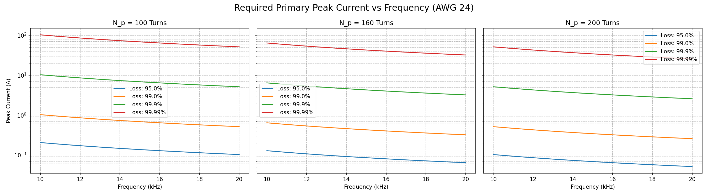
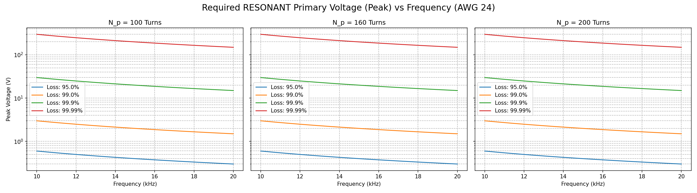
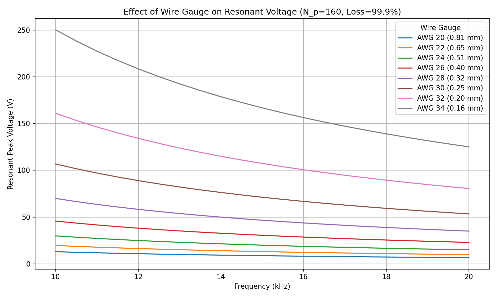
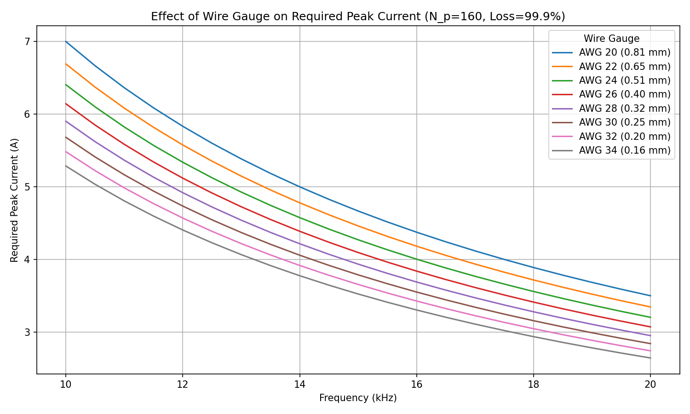

# Axle Counter Parameter Sweep & Concept Explanations

This report provides detailed explanations of the electromagnetic phenomena governing your axle counter design, followed by extensive parameter sweeps across flux loss, primary turns ($N_p$), frequency, and wire gauge.

---

## 1. Demystifying the "Complicated Terms"

### Magnetic Flux Loss & Coupling Efficiency
* **Magnetic Flux ($\Phi$):** Think of this as the "amount of magnetic field" generated by the primary coil.
* **Flux Loss:** In an ideal transformer, 100% of the magnetic field generated by the primary coil passes through the secondary coil. However, in an open-air system like an axle counter, most of the magnetic field leaks out into the surrounding space. 
* **99.99% Flux Loss:** This means that only **$0.01\%$** (a fraction of $10^{-4}$) of the magnetic flux generated by the primary coil actually links with (passes through) the secondary coil. The remaining 99.99% is "lost" to the environment. This extremely low coupling efficiency is what forces us to use such high primary currents to induce a small $3\text{ V}$ signal on the secondary.

### Skin Effect
* **What is it?** When you push an alternating current (AC) through a wire, the rapidly changing magnetic field created by the current forces the electrons to migrate toward the outer surface—the "skin"—of the wire. 
* **Why does it matter?** Because the electrons are crowded into a thin outer layer rather than using the whole cross-section of the wire, the effective area of the wire is reduced. A smaller effective area means **higher electrical resistance**.
* **Skin Depth ($\delta$):** This is the depth from the surface where the majority of the current flows. As you increase the frequency (from $10\text{ kHz}$ to $20\text{ kHz}$), the skin depth gets thinner, causing the AC resistance ($R_{AC}$) to increase significantly compared to standard DC resistance. For example, thicker wires (lower AWG) suffer more from the skin effect than thinner wires.

### Inductive Reactance ($X_L$) & Impedance ($Z$)
* **Inductance ($L$):** A coil's natural resistance to *changes* in current.
* **Inductive Reactance ($X_L = 2\pi f L$):** In an AC circuit, an inductor heavily opposes the flow of alternating current. The higher the frequency ($f$) or inductance ($L$), the harder it is to push the current through. This opposition is measured in Ohms ($\Omega$) just like resistance.
* **Impedance ($Z$):** The total combined opposition to current flow, factoring in both the wire's resistance ($R_{AC}$) and the coil's inductive reactance ($X_L$). 

### Resonant Matching (Tuning)
* **The Problem:** Because our primary coil has high inductance and operates at high frequencies ($10\text{-}20\text{ kHz}$), its Inductive Reactance is massive (hundreds of Ohms). To push the required large current through this massive reactance, we calculated earlier that you would need thousands of volts (e.g., $50\text{ kV}$).
* **The Solution:** We can add a capacitor in series with the coil. Capacitors have "Capacitive Reactance" ($X_C$) which behaves exactly opposite to Inductive Reactance. By carefully selecting a capacitor where $X_C = X_L$, they **completely cancel each other out!** 
* **The Result:** Once cancelled, the only opposition left in the circuit is the tiny physical wire resistance ($R_{AC}$). We can now drive the exact same massive current using a very small, practical voltage (tens or hundreds of volts).

---

## 2. Parameter Sweep Results

To visualize the complex relationships between all your parameters, we generated a Python script that sweeps:
* **Flux Loss:** $95.0\%$ to $99.99\%$ in $0.1\%$ increments.
* **Primary Turns ($N_p$):** $100$ to $200$ turns.
* **Frequency ($f$):** $10\text{ kHz}$ to $20\text{ kHz}$ in $500\text{ Hz}$ increments.
* **Wire Gauge (AWG):** $34$ to $20$ (in 2-gauge increments).

*(Note: In the graphs below, the Y-axis is plotted on a logarithmic scale because the values jump dramatically as flux loss approaches 99.99%).*

### Required Primary Peak Current vs. Frequency
This graph shows how much current you need to achieve your $3\text{ V}_{p-p}$ target. Notice how drastically the current spikes when you move from $99\%$ flux loss to $99.99\%$ flux loss. Also observe that **increasing the primary turns ($N_p$) lowers the required current.**

### Required Resonant Primary Voltage vs. Frequency
This graph shows the voltage required to drive the above currents, **assuming you are using resonant matching (a series capacitor).** Notice that while higher primary turns ($N_p$) reduce the required current, they actually **increase** the required driving voltage because the coil's physical wire gets longer (higher resistance).

### Effect of Wire Gauge on Resonant Voltage
Here we fix $N_p = 160$ and Flux Loss $= 99.9\%$ to isolate the effect of wire thickness. 
* **Thinner wires (AWG 34, 32)** have much higher physical resistance, requiring massive driving voltages.
* **Thicker wires (AWG 22, 20)** have much lower resistance, significantly reducing the required driving voltage. However, note that at $20\text{ kHz}$, the benefit of thicker wires starts to diminish slightly due to the **skin effect** explained earlier!

### Effect of Wire Gauge on Required Peak Current
While gauge primarily affects resistance (and thus driving voltage), it actually has a slight effect on the required peak current as well.
* **Why?** The physical thickness of the wire (radius $a$) slightly changes the overall inductance $L_p$ of the primary coil because it changes how tightly the magnetic field lines pack around the wire itself.
* **Result:** Thicker wires (lower AWG) slightly *decrease* the inductance $L_p$, which in turn slightly *decreases* the mutual inductance $M$. A lower mutual inductance means you have to pump slightly *more* current into the thicker wire to induce the same $3\text{ V}$ target on the secondary!

---

## 3. Resonant Capacitor Requirements

While resonant tuning solves the high-voltage driving problem, it shifts the burden onto the tuning capacitor ($C_p$). At resonance, the inductive reactance ($X_L$) and capacitive reactance ($X_C$) cancel each other out from the driver's perspective, but the physical components still experience massive voltages and currents internally.

The voltage across the series tuning capacitor is $V_{C, peak} = I_{p, peak} \times X_C$. Because the required peak currents are so large (tens to hundreds of Amperes) and the frequency is high ($10\text{-}20\text{ kHz}$), the capacitor must endure extreme conditions:

* **Massive Voltage Rating:** The peak voltage across the capacitor will easily reach tens of kilovolts (e.g., $30\text{ kV}$ to $60\text{ kV}$ depending on flux loss and turns).
* **High RMS Current:** The capacitor must handle continuous high-frequency AC currents without overheating.
* **Low ESR / High dV/dt:** Standard electrolytic or ceramic capacitors will instantly fail or explode under these conditions. You need specialized **pulse capacitors** (often Mica, high-power Polypropylene Film, or specialized RF matching capacitors) designed specifically for induction heating or wireless power transfer applications.

---

## 4. Full Spreadsheet Data

All the raw data for every combination of Frequency, Primary Turns, Flux Loss, and Wire Gauge (including the exact required capacitor values in Farads and capacitor peak voltages) has been compiled into a CSV spreadsheet for your convenience:

📄 **[Download Data Spreadsheet](file:///./axle_counter_sweep_data.csv)**

---

## 5. Feasibility Analysis: Limiting Capacitor Voltage to $\le 250\text{V}$

You asked whether voltages above $250\text{V}$ are industrially available, and requested an analysis constrained to $\le 250\text{V}$.

### Are $>250\text{V}$ AC Capacitors Industrially Available?
**Yes, absolutely.** While standard consumer electronics capacitors are typically rated for $50\text{V}$ to $400\text{V}$ DC, the industrial power electronics sector routinely uses extremely high-voltage AC capacitors. 
* Systems like induction heaters, wireless EV chargers, and MRI machines use **Water-cooled Conduction Coiled Mica Capacitors** (e.g., from Celem) or **High-power Polypropylene Film Capacitors** (e.g., WIMA FKP series). 
* These are readily available off-the-shelf to handle $1,000\text{V}$ to $100,000\text{V}$ AC and hundreds of Amps. However, they are bulky and expensive.

### What if we strictly limit the design to $\le 250\text{V}$?
If you want to use cheaper, easily procurable components, we must limit $V_{C, peak} \le 250\text{V}$. Filtering our parameter sweep data for this strict condition reveals a critical physical reality:

* **The $250\text{V}$ condition is ONLY met when Flux Loss is $\le 99.0\%$ (Coupling Efficiency $\ge 1\%$).**
* At $95.0\%$ flux loss (our best-case scenario), the capacitor voltage drops down to a highly manageable $50\text{V} - 100\text{V}$ range.
* At $99.0\%$ flux loss, the capacitor voltage sits exactly at the $250\text{V}$ boundary.
* If flux loss exceeds $99.0\%$, the voltage skyrockets out of the $\le 250\text{V}$ bounds.

**Conclusion:** To keep your electronics simple, cheap, and easily procurable, you **cannot** afford a $99.99\%$ open-air flux loss. You must ensure your coils are coupled better than $1\%$. This heavily reinforces the need for **Ferrite U-Cores or Pot Cores** to guide the magnetic flux directly across the rail gap, thereby pulling the flux loss down into the $95\%$ range and bringing your voltages under $250\text{V}$!

We have exported a specialized spreadsheet containing ONLY the configurations that keep the capacitor voltage under $250\text{V}$:

📄 **[Download <=250V Practical Spreadsheet](file:///./axle_counter_practical_data.csv)**

---

## Conclusion
The full interactive data and generation code for these parameter sweeps are available in the [sweep_analysis.ipynb](file:///c:/Users/rudra/Axle_counter/axlecounter_3dphysics/sweep_analysis.ipynb) notebook. You can modify the constants there to run further custom sweeps.
